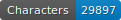
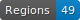
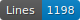
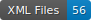

# HTR data for the SETAF project

   

Coucou Aurélia

## Data

ALTO files with segmentation and transcription

## Licence

Transcriptions ar eopen source, not the images which belong to the library.

## Citation

Aurélia Oliveira, _Data for the SETAF project_, Université de Genève, 2023.
